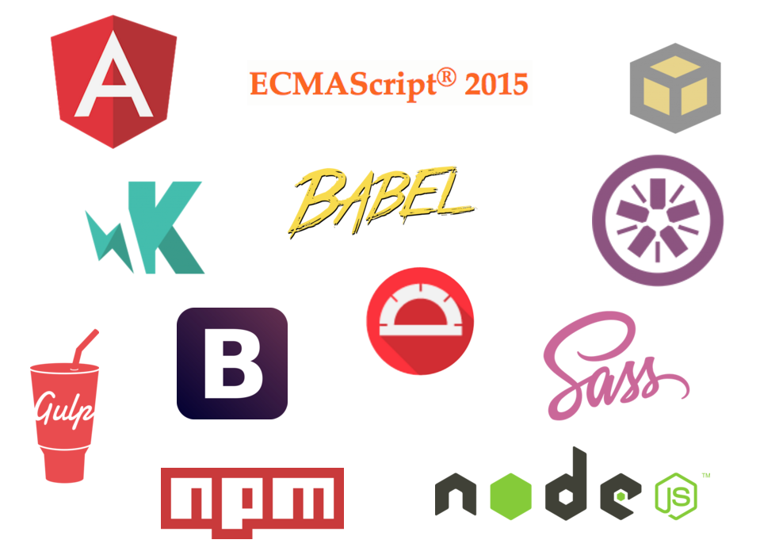
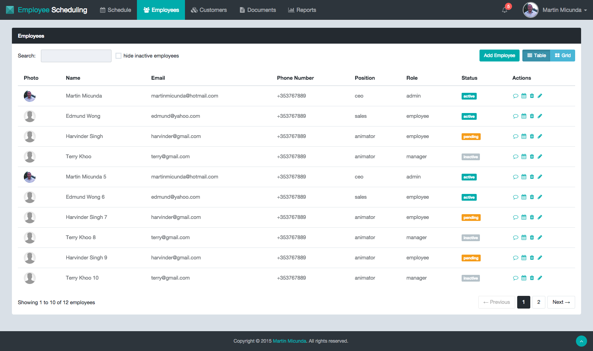

Employee Scheduling UI
======================

[](https://gitter.im/martinmicunda/employee-scheduling-ui?utm_source=badge&utm_medium=badge&utm_campaign=pr-badge&utm_content=badge)
[](http://travis-ci.org/martinmicunda/employee-scheduling-ui)
[](https://ci.appveyor.com/project/martinmicunda/employee-scheduling-ui/branch/master)
[](https://david-dm.org/martinmicunda/employee-scheduling-ui#info=devDependencies) 
[](https://coveralls.io/github/martinmicunda/employee-scheduling-ui?branch=master)
[](https://codeclimate.com/github/martinmicunda/employee-scheduling-ui)
[](http://www.gnu.org/licenses/gpl-3.0.html)

An UI component for [Employee Scheduling](https://github.com/martinmicunda/employee-scheduling) application that makes employee scheduling management easy, fast and mobile. The API component for this application can be found [here](https://github.com/martinmicunda/employee-scheduling-api). I wrote a few blog posts about this project and they can be found on my [blog](http://martinmicunda.com).

## Table of Contents
- [Technologies Used](#technologies-used)
- [Features](#features)
- [Demo](#demo)
- [Folder Structure](#folder-structure)
    - [Development](#folder-structure-development)
    - [Production](#folder-structure-production)
- [Installation & Configuration](#installation-and-configuration)
    - [Platform & Tools](#platform-and-tools)
    - [Installation](#installation)
- [How to Run](#how-to-run)
    - [Development](#how-to-run-development) 
    - [Test](#how-to-run-test) 
    - [Production](#how-to-run-production) 
- [How to Test](#how-to-test)
    - [Unit](#how-to-test-unit) 
    - [E2E](#how-to-test-e2e) 
- [How to Build](#how-to-build)
- [How to Deploy](#how-to-deploy)
- [How to Release](#how-to-release)
- [License](#license)

## Technologies Used


## Features
  * Use ES6 with Angular 1.x
  * Use ES6 Modules via [SystemJS](https://github.com/systemjs/systemjs) and [ES6 Module Loader Polyfill](https://github.com/ModuleLoader/es6-module-loader)
  * Use [ES7 decorators](https://github.com/wycats/javascript-decorators) to avoid Angular 1.x boilerplate code
  * [Conditional module loading with SystemJS](http://martinmicunda.com/2015/10/26/conditional-module-loading-with-systemjs/)
  * JSON Web Token ([JWT](http://jwt.io)) authentication
  * User roles authorization
  * Unit test with ES6, Babel, JSPM, Karma, Jasmine and Istanbul
  * Manage development and production workflow with [JSPM](http://jspm.io/), [SystemJS builder](https://github.com/systemjs/builder) and [Gulp](http://gulpjs.com/)
  * Mocked Backend Workflow - help with mocking backend-less development
  * Achieve some of the Angular 2.0 goals while still running on Angular 1.x
  * Produce optimised, production ready code for deployment and automatically deploy this code to [gh-pages](https://github.com/martinmicunda/employee-scheduling-ui/tree/gh-pages) after each commit via [Travis CI](https://travis-ci.org/martinmicunda/employee-scheduling-ui)
  * Schedule events and availabilities with [FullCalendar.js](http://fullcalendar.io/) 
  
## Demo
This demo is running from [gh-pages](https://github.com/martinmicunda/employee-scheduling-ui/tree/gh-pages) branch in backend-less development env (see [How to Run](#how-to-run-test) section). Below, you can find login credentials for different user roles.

|    ROLE    |        EMAIL        |   PASSWORD   |
|:----------:|:-------------------:|:------------:|
|  employee  |  employee@test.com  |   password   |
| supervisor | supervisor@test.com |   password   |
|   manager  |   manager@test.com  |   password   |
|    admin   |    admin@test.com   |   password   |

<a href="http://martinmicunda.github.io/employee-scheduling-ui/dist" target="_blank">Click here to see it in action!</a>



##<a name="folder-structure"></a>Folder Structure

###<a name="folder-structure-development"></a>Development
TODO: (martin) add folder development structure

###<a name="folder-structure-production"></a>Production
    build/               
      |- dist                       --> distribution source code that goes to production
      |  |- fonts/                     --> fonts
      |  |- images/                    --> image files
      |  |- scripts/                   --> js files 
      |  |  |- main.min-12345.js           --> concat, minify angular app js files and cached html templates      
      |  |- styles/                    --> css files 
      |     |- main.min-12345.css          --> concat & minify app css files 
      |  |- index.html                 --> app main file
      |- docs/                      --> app documentation   
           
##<a name="installation-and-configuration"></a>Installation & Configuration

###<a name="platform-and-tools"></a>Platform & Tools
You need to install Node.js and then the development tools. Node.js comes with a package manager called [npm](http://npmjs.org) (requires npm version >= 2.0.0 for this project) for installing NodeJS applications and libraries.

[Install Node.js](http://nodejs.org/download/) (requires node.js version >= 0.12.0)

###<a name="installation"></a>Installation

**1.** Clone or [fork](https://github.com/martinmicunda/employee-scheduling-ui/fork) this repository:
```bash
$ git clone git@github.com:martinmicunda/employee-scheduling-ui.git 
$ cd employee-scheduling-ui
```

**2.** Install local dependencies
```bash
$ npm install
```
> **Note:** Verify that all 3rd party dependencies from [package.json](package.json) are installed on your local machine. If you have followed the instructions and there have been no errors when executing the above commands, the dependencies should be installed.
     
##<a name="how-to-run"></a>How to Run

###<a name="how-to-run-development"></a>Development
When you're working on project with real back-end start with:

```bash
$ npm start 
```
> **NOTE:** The `npm start` task is alias for `npm start -- --env=DEV`. The back-end code for this application can be found [here](https://github.com/martinmicunda/employee-scheduling-api).

This task will install all dependencies, build dev environment, monitor the source files, compile SASS to CSS and launch the browser. The task also includes [Browsersync](http://www.browsersync.io/), so you no longer have to manually refresh your page after making changes! Make sure `API_URL` constant in [`gulp/const.js`](gulp/const.js) file points to your API back-end.

If you don't want to launch the browser when serving code then pass `--open=false` flag:

```bash
$ npm start -- --open=false
```

###<a name="how-to-run-test"></a>Test 
When you're working on project without real back-end start with:

```bash
$ npm start -- --env=TEST
```
> **NOTE:** This is really useful for backend-less testing in CI env or backend-less development if you don't have access to real back-end. Data from `fixtures` folders will be served.

If you want to run production optimized code with `fixtures` data start with: 
```bash
$ npm start -- --env=TEST --optimize=true
```
> **NOTE:** This produce optimized build like `--env=PROD` and also include `fixtures` data into bundle.

###<a name="how-to-run-production"></a>Production
When you're working on project with real back-end and want to try production bundle start with:

```bash
$ npm start -- --env=PROD
```

> **NOTE:** This run against the code specify in `build/dist` folder. See [build](#build) section for more details how `build` is created.


##<a name="how-to-test"></a>How to Test
###<a name="how-to-test-unit"></a>Unit 
Every time the unit tests are executed, a [coverage report](http://martinmicunda.com/employee-scheduling-ui/test-reports/coverage/firefox/) is created in the `test-reports/coverage` sub-directory and coverage `thresholds` can be set in `COVERAGE` constant in [`gulp/const.js`](gulp/const.js) file. The `npm test` task has optional arguments `--browsers=(IE|PhantomJS|Chrome|Firefox|Safari)`, `--watch` and `--nocoverage`.  Make sure that the browsers you want to run test against are installed on your local machine. The `PhantomJS` should be already installed after you run `npm install`.

To run test start with:

```bash
$ npm test
```
> **NOTE:** The `npm test` task is alias for `npm run test-unit -- --browsers=PhantomJS`.

To run test against specific browser e.g. `Chrome` start with:
```bash
$ npm test -- --browsers=Chrome
```

To run test against multiple browsers at the same time start with:
```bash
$ npm test -- --browsers=IE,Chrome,Firefox,Safari 
```
   
To watch for file changes and re-run tests on each change start with:
```bash
$ npm test -- --watch
```

To watch for file changes and re-run tests without coverage report start with:
```bash
$ npm test -- --watch --nocoverage
```

To run test and push coverage report to [Coveralls](https://coveralls.io/) start with:
```bash
$ npm test -- --watch --coveralls
```
###<a name="how-to-test-e2e"></a>E2E 
TODO

##<a name="how-to-build">How to Build
The build task get app ready for production. The build task include transpilation from ES6 to ES5, concatenation, minification, compression, asset revision, template cache, cdn etc. If there have been no errors when executing the build command, the build should be located in `build/dist` directory and this build is ready for uploading to the server! To initiate a full build, you simply run the follow task:
```bash
$ npm run build
```

If you want use CDN then add your CDN url to `CDN_URL` constant in [`gulp/const.js`](gulp/const.js) file and then run the build task with argument `--cdn` to replace local path with CDN url: 
```bash
$ npm run build -- --cdn
```

##<a name="how-to-deploy"></a>How to Deploy
TODO

##<a name="how-to-release"></a>How to Release
TODO

## License

    Copyright (c) 2014-2015 Martin Micunda  

    Source code is open source and released under the GNU GPL v3 license.
