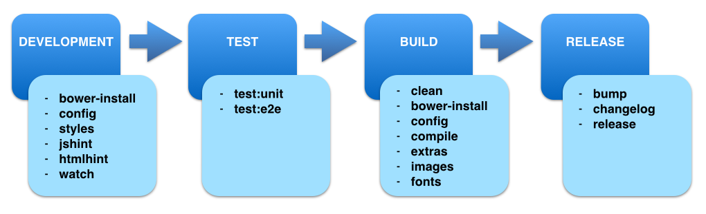

employee-scheduling-ui
======================
[](http://travis-ci.org/martinmicunda/employee-scheduling-ui) [](https://david-dm.org/martinmicunda/employee-scheduling-ui) [](https://david-dm.org/martinmicunda/employee-scheduling-ui#info=devDependencies) [](https://coveralls.io/r/martinmicunda/employee-scheduling-ui?branch=master)

An UI component for [Employee Scheduling](https://github.com/martinmicunda/employee-scheduling) application.

**Note: :warning: This project is under development.**

## Gulp Tasks
The best way to learn about the gulp tasks is by familiarizing yourself with [Gulp](http://gulpjs.com/) and then reading through the documented [gulpfile.js](gulpfile.js) script.



###Sub Tasks:###
| Command                          | Description | 
| -------------------------------- | ----------- | 
| `gulp clean` | will delete `build` and `.tmp` directories | 
| `gulp extras` | will copy project files that haven't been copied by `compile` task e.g. (bower.json, favicon, etc.) into the `build/dist` directory | 
| `gulp bower-install` | will install all bower components specify in [`bower.json`](bower.json) from bower repository and inject bower components into the [`index.html`](src/index.html) | 
| `gulp config` | will configuration Angular app for development or production environment |
| `gulp jshint` | will run linter against javascript files |
| `gulp htmlhint` | will run linter against html files | 
| `gulp styles` | will compile sass files into the `src/.tmp/main.css` |
| `gulp templatecache` | will replace local links with CDN links for images inside of templates, minify html templates and then put all templates into strings in a JavaScript file that will add the template to AngularJS's [`$templateCache`](http://docs.angularjs.org/api/ng.$templateCache) so template files are part of the initial JavaScript payload and do not require any future XHR. The template cache files are `src/.tmp/scripts/templates.js` |
| `gulp watch` |  will watching for file changes, in addition browser will be refreshed with every change | 
| `gulp fonts` | will copies fonts to `build/dist` directory |
| `gulp images` | will minifies and copies images to `build/dist` directory |
| `gulp compile` | will concatenate, minify, cdnize and revesion sources and place them by default into the `build/dist` directory | 
| `gulp setup` | will configure environment, compile SASS to CSS, install bower dependencies and inject installed bower dependencies into the `index.html` |
| `gulp help` | will print all tasks with description of each task | 

###Main Tasks:###
The main gulp tasks are descriptive more in `development`, `test`, `build` and `release` sections.

| Command                          | Description | 
| -------------------------------- | ----------- |
| `gulp` | will launch the browser, install bower dependencies, build dev environment, monitor the source files and run styles, jshint and htmlhint tasks every time a file changes. |
| `gulp test:unit` | will run unit tests |
| `gulp test:e2e` | will run e2e tests |
| `gulp build` | will create build that is ready for uploading to the server |
| `gulp bump` | will increment version number in [`package.json`](package.json) and [`bower.json`](bower.json)|
| `gulp changelog` | will generate changelog in [`CHANGELOG.md`](CHANGELOG.md) |
| `gulp release` | will release and push [`package.json`](package.json) and [`CHANGELOG.md`](CHANGELOG.md) to GitHub repo | 

## Development
Whenever you're working on project, start with:

```bash
$ gulp 
```
> **NOTE:** The `gulp` task is alias for `gulp:serve`.

This default gulp task will launch the browser, install bower dependencies, build dev environment, monitor the source files and run `styles`, `jshint` and `htmlhint` tasks every time a file changes. The default gulp task also includes [Live Reload](http://livereload.com/), so you no longer have to refresh your page after making changes! The following code must be add to the end of the `body` tag in [index.html](src/index.html):

```html
<script src="http://localhost:35729/livereload.js?snipver=1"></script>
```

## Test
The `test:unit` and `test:e2e` tasks have optional arguments `--browsers=(PhantomJS|Chrome|Firefox|Safari)` and `--env=(development|production)`. If you don't specify these optional arguments then the default value for `--browsers` is `PhantomJS` and default value for `--env` is `development`.

App test-reports (coverage, failure screenshots etc.) can be found under `src/test/test-reports/` directory.

* **Unit test examples:**

   This will run test against `PhantomJS` and code specify in `src/` folder:
   ```bash
   $ gulp test:unit
   ```
   This will run test against `Chrome`:
   ```bash
   $ gulp test:unit --browsers=Chrome 
   ```
   To run test against multiple browsers at the same time run follow task:
   **TODO: (martin)** this task is not supported yet!
   ```bash
   $ gulp test:unit --browsers=Chrome,Firefox,Safari 
   ```
     This will watch for file changes and re-run tests on each change:
   ```bash
   $ gulp test:unit --watch
   ```
   > **NOTE:** Verify that the browsers you want to run test against are installed on your local machine. The `PhantomJS` should be already installed after you run `npm install`.

* **E2E test examples:**

   This will run test against `PhantomJS`  and code specify in `src/ `folder:
   **TODO (martin)** at the moment default browser is set to Chrome because there is an issue with PhantomJS and protractor
   ```bash
   $ gulp test:e2e
   ```
   
   This will run test against `Chrome`  and code specify in `build/dist` folder:
   ```bash
   $ gulp test:e2e --browsers=Chrome --env=production
   ```    
   
      > **NOTE:** Verify that you are running application before executing the above command. On first run this might take a while as Protractor's webdriver must be downloaded and installed.

## Build
The build task get app ready for production. The build task include concatenation, minification, compression, cdn etc. If there have been no errors when executing the build command, the build should be located in `build/dist` directory and this build is ready for uploading to the server!. To initiate a full build, you simply run the follow task:
```bash
$ gulp build
```

If you want use CDN add your CDN url to `PRODUCTION_CDN_URL` variable in [`gulpfile.js`](gulpfile.js) file and then run the build task with argument `--cdn` to replace local path with CDN url: 
```bash
$ gulp build --cdn
```

## Release
TODO: add release steps
